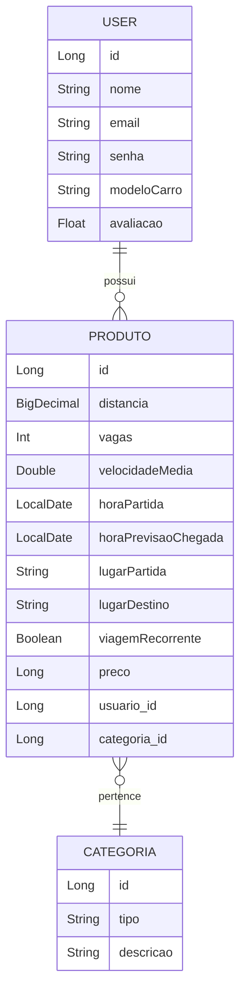

# 📚 **API de Aplicativo de Caronas**

### 🚗 Uma API desenvolvida para um aplicativo de caronas colaborativas, com funcionalidades de gerenciamento de viagens, cálculo automático da hora de chegada, cadastro de usuários e sistema seguro de login.

---

## 📋 **Índice**

1. [Sobre o Projeto](#sobre-o-projeto)
2. [Funcionalidades Principais](#funcionalidades-principais)
3. [Tecnologias Utilizadas](#tecnologias-utilizadas)
4. [Entidades](#entidades)
5. [Relação Entre Tabelas](#relação-entre-tabelas)
6. [Instalação e Execução](#instalação-e-execução)
7. [Endpoints da API](#endpoints-da-api)
8. [Deploy](#deploy)
9. [Testes](#testes)
10. [Integrantes](#integrantes)

---

## 📌 **Sobre o Projeto**

A API foi criada como base para um **aplicativo de caronas colaborativas**. Seu objetivo é conectar motoristas e passageiros que compartilham trajetos similares, proporcionando uma maneira mais econômica e eficiente de viajar. A aplicação inclui um sistema completo de gerenciamento de viagens, com cálculo automático da hora de chegada, além de segurança no login e cadastro dos usuários.

A API é desenvolvida utilizando **Spring Boot**, integrada ao banco de dados **PostgreSQL** e hospedada na plataforma **Render** com suporte a **Docker**.

---

## ✨ **Funcionalidades Principais**

- **CRUD completo** para:
    - Gerenciamento de **viagens**.
    - Cadastro de **categorias** de viagens.
    - Cadastro e controle de **usuários**.
- **Busca por ID** das entidades.
- **Cálculo automático** da hora de previsão de chegada com base na **hora de partida**, **velocidade média** e **distância**.
- Sistema de **login seguro** com autenticação utilizando **Spring Security**.
- Documentação interativa com **Swagger**.
- Banco de dados gerenciado com **PostgreSQL**.
- Deploy automatizado com **Render** e suporte ao **Docker**.
- **Testes unitários** com **JUnit**.

---

## 🛠️ **Tecnologias Utilizadas**

- **Java 17** - Linguagem de programação principal.
- **Spring Boot** - Framework utilizado para acelerar o desenvolvimento da API.
    - **Spring Web** - Gerenciamento de requisições HTTP.
    - **Spring Data JPA** - Persistência de dados.
    - **Spring Security** - Implementação de segurança e autenticação.
- **PostgreSQL** - Banco de dados relacional.
- **Swagger** - Documentação interativa da API.
- **Docker** - Containerização da aplicação.
- **Render** - Plataforma de hospedagem para deploy.
- **JUnit** - Ferramenta para testes unitários.
- **Maven** - Gerenciador de dependências.

---

## 🗃️ **Entidades**

### 🚘 **Produto (Viagem)**
| Campo                 | Tipo            | Descrição                                |
|-----------------------|-----------------|-----------------------------------------|
| `id`                 | Long            | Identificador único da viagem.          |
| `distancia`          | BigDecimal      | Distância total do trajeto (em km).     |
| `vagas`              | Int             | Quantidade de vagas disponíveis.        |
| `velocidadeMedia`    | Double          | Velocidade média esperada (em km/h).    |
| `horaPartida`        | LocalDate       | Hora de início da viagem.               |
| `horaPrevisaoChegada`| LocalDate       | Hora calculada de chegada.              |
| `lugarPartida`       | String          | Local de início da viagem.               |
| `lugarDestino`       | String          | Local de destino da viagem.             |
| `viagemRecorrente`   | Boolean         | Indica se a viagem é recorrente.        |
| `preco`              | Long            | Preço da viagem.                        |
| `usuario_id`         | Long            | Identificador do usuário responsável.   |
| `categoria_id`       | Long            | Identificador da categoria da viagem.   |

### 🏷️ **Categoria**
| Campo        | Tipo    | Descrição                                |
|--------------|---------|-----------------------------------------|
| `id`        | Long    | Identificador único da categoria.        |
| `tipo`      | String  | Tipo da categoria (ex: "Longa", "Curta"). |
| `descricao` | String  | Descrição da categoria.                  |

### 👤 **User (Usuário)**
| Campo            | Tipo     | Descrição                                |
|------------------|----------|-----------------------------------------|
| `id`            | Long     | Identificador único do usuário.          |
| `nome`          | String   | Nome do usuário.                         |
| `email`         | String   | Email para login.                        |
| `senha`         | String   | Senha do usuário (criptografada).        |
| `modeloCarro`   | String   | Modelo do carro do usuário.              |
| `avaliacao`     | Float    | Avaliação média do motorista.            |

---

## 🔗 **Relação Entre Tabelas**



---

## 🚀 **Instalação e Execução**

1. **Clone o repositório**:
   ```bash
   git clone https://github.com/MatheusSPQ/BlogPessoal.git
   ```

2. **Configure o banco de dados PostgreSQL**:
    - Crie um banco de dados chamado `db_blogpessoal`.
    - Configure o arquivo `application.properties` com suas credenciais PostgreSQL:
      ```properties
      spring.datasource.url=jdbc:postgresql://localhost:5432/db_blogpessoal
      spring.datasource.username=seu_usuario
      spring.datasource.password=sua_senha
      spring.jpa.hibernate.ddl-auto=update
      ```

3. **Execute o projeto**:
   ```bash
   ./mvnw spring-boot:run
   ```

4. **Acesse a documentação Swagger**:
    - URL padrão: `http://localhost:8080/swagger-ui.html`

---

## 🔗 **Endpoints da API**

### Produto (Viagem)
- **GET /viagens** - Lista todas as viagens.
- **GET /viagens/{id}** - Busca uma viagem por ID.
- **POST /viagens** - Cria uma nova viagem.
- **PUT /viagens** - Atualiza uma viagem existente.
- **DELETE /viagens/{id}** - Deleta uma viagem.

### Categoria
- **GET /categorias** - Lista todas as categorias.
- **GET /categorias/{id}** - Busca uma categoria por ID.
- **POST /categorias** - Cria uma nova categoria.
- **PUT /categorias** - Atualiza uma categoria existente.
- **DELETE /categorias/{id}** - Deleta uma categoria.

### Usuário
- **POST /usuarios/cadastrar** - Cadastra um novo usuário.
- **POST /usuarios/login** - Realiza login.
- **GET /usuarios** - Lista todos os usuários
- **GET /usuarios/{id}** - Busca um usuário por ID.
- **PUT /usuarios** - Atualiza um usuário
- **DELETE /usuarios/delete/{id}** - Deleta um usuário

---

## 📦 **Deploy**

O projeto é hospedado na plataforma **Render** e utiliza **Docker** para containerização.

- Link do deploy: `em processo*`

---

## 👥 **Colaboradores**

<table>
  <tr>
    <td align="center">
      <a href="https://github.com/MatheusSPQ">
        <br />
        <sub><b>Matheus Queiroz</b></sub>
      </a>
    </td>
    <td align="center">
      <a href="https://github.com/Ninaraquel">
        <br />
        <sub><b>Nina Raquel</b></sub>
      </a>
    </td>
        <td align="center">
      <a href="https://github.com/lucassai">
        <br />
        <sub><b>Lucas Oliveira</b></sub>
      </a>
    </td>
          <td align="center">
      <a href="https://github.com/IJNavi">
        <br />
        <sub><b>Ivan Barbosa</b></sub>
      </a>
    </td>
    </td>
          <td align="center">
      <a href="https://github.com/Jaquelinevalle">
        <br />
        <sub><b>Jaqueline Valle</b></sub>
      </a>
    </td>
  </tr>
</table>

---

**Desenvolvido com 💻, dedicação e muita colaboração!** 🚀
